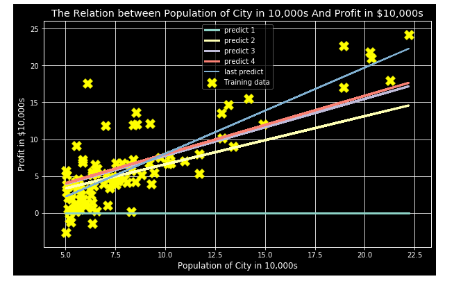
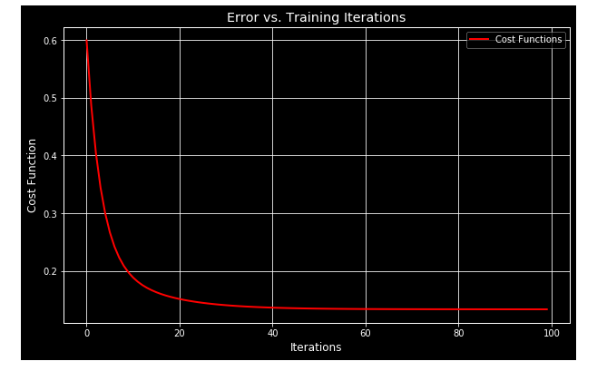
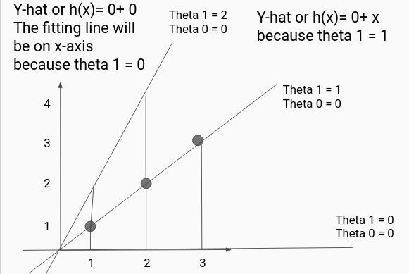

# All you need about Linear Regression

## some of text and snapshots are related to coursera Machine Learning Course

## some tasks also solved in Octave language
## some of tasks implemented in different libraries and frameworks like Tensorflow and sklearn

### The repo is cosisit of these things:

**Materials**

- Materials in Arabic from my studying to different courses
- English slides for Linear Regression that Explain the different aspect of Linear Regression
- Examples For more understanding

**Tasks Implemented**

- Hello Linear Regression without features normalization
- Hello Linear Regression with features normalization
- Manual Linear Regression Task from ex1 of week2 Ml By Andrew Ng in python.
- The same Task but using Sklearn
- The same Task but using Tensorflow
- Udacity boston_housing

**Different Graphs that help get more intuition**

- ploting data
- Cost function graph
- different fitting line

**some snapshot of different graph and slides and Examples**
- Fitting different line to data

- Cost function decreasing

- Some of work in slides

 

