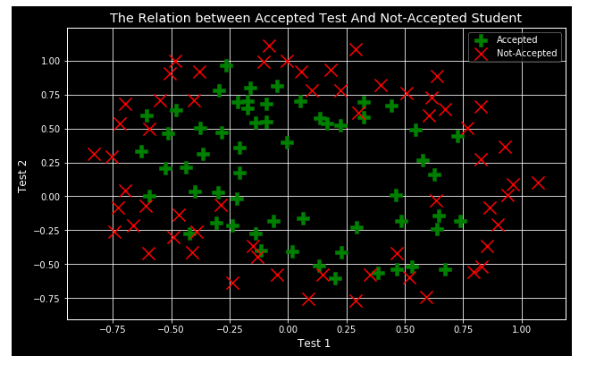
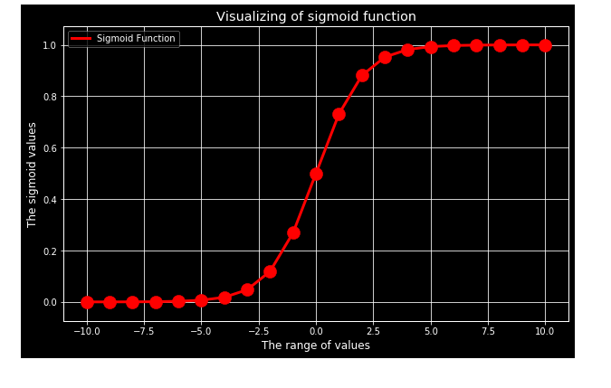
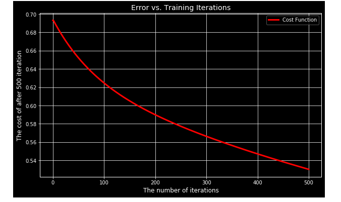
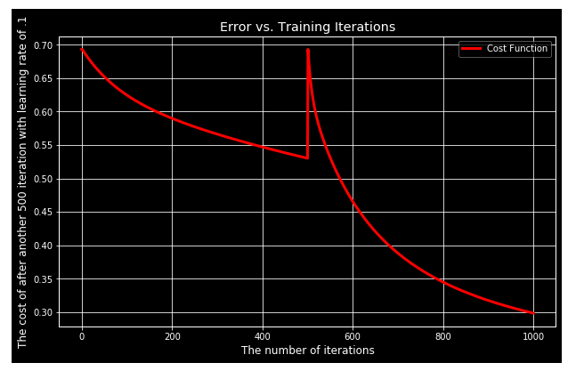

# All you need about Logistic Regression (Classification)

## some of text and snapshots are related to coursera Machine Learning Course

## some tasks also solved in Octave language
## some of tasks implemented in different libraries and frameworks like Tensorflow and sklearn

### The repo is cosisit of these things:

**Materials**

- Materials in Arabic from my studying to different courses
- English slides for Logistic Regression that Explain the different aspect of Classification
- Examples For more understanding

**Tasks Implemented**
- Hello Logistic Regression
- python code for Binary Classification with Andrew Ng Course
- Manual Logistic Regression Task from ex2 of week3 Ml By Andrew Ng in python.
- Sklearn Logistic Regression Task from ex2 of week3 Ml By Andrew Ng in python.
- Tensorflow Logistic Regression Task from ex2 of week3 Ml By Andrew Ng in python.
- Tensorflow clothes Image classifcation
- Tensorflow handwriting numbers Image classifcation

**Different Graphs that help get more intuition**

- ploting data
- Sigmoid function
- Cost function graph

**some snapshot of different graph and slides and Examples**
- ploting data

- Sigmoid function

- different Cost function plots

 

